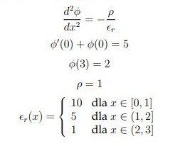
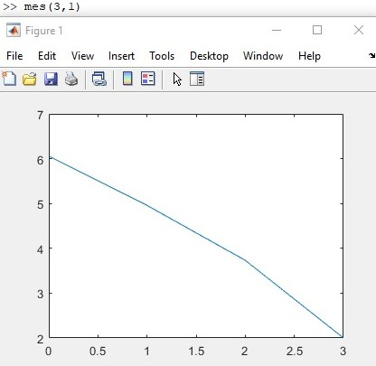
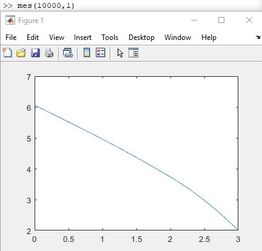

# Differential equation

Simple MATLAB program to find and visualise solution of electrical potential equation, using finite element method. Was made on RRIR subject.

  

## Technologies

* MATLAB 2020b - academic use.

## Setup
To run this program, you need to run main function - mes(n,ro). It takes two intput arguments:

* n - number of elements 
* ro - constant 

## Visuals 
As a result we get estimated graph of equation.

  

  

